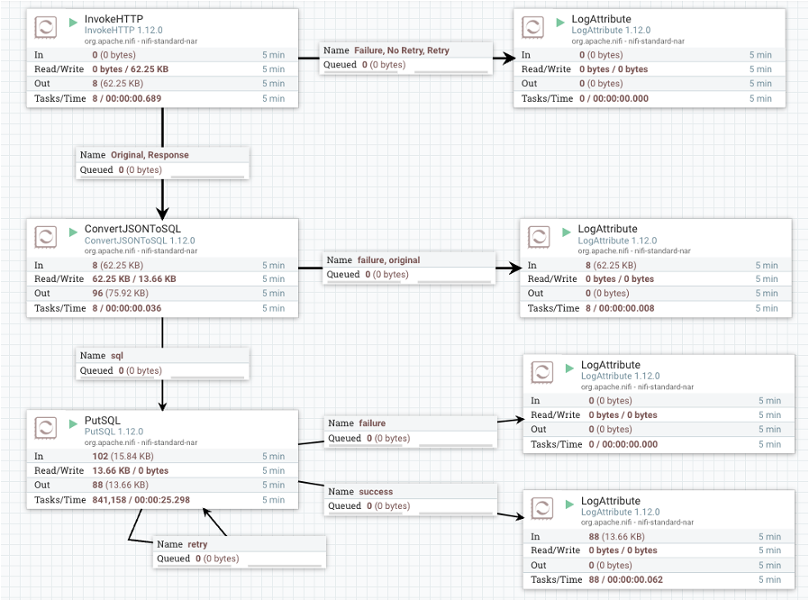

# Apache NiFi Setup

## Overview
Set up Apache NiFi version 1.12.0 for data ingestion in the final project.

## Steps
1. **Run NiFi Container**: Run an Apache NiFi container.
    ```
    docker run --name nifi -p 8080:8080 -p 8443:8443 --link mysql:mysql -d apache/nifi:1.12.0
    ```

2. **Access NiFi Interface**: Open your web browser and navigate to `http://<your_server_ip>:8080/nifi/` to access the NiFi interface.

3. **Import XML Configuration**: Import the provided `NiFi-ttc-final.xml` file to set up the NiFi data ingestion pipeline.

## NiFi Structure
Below is the structure of the NiFi setup:


