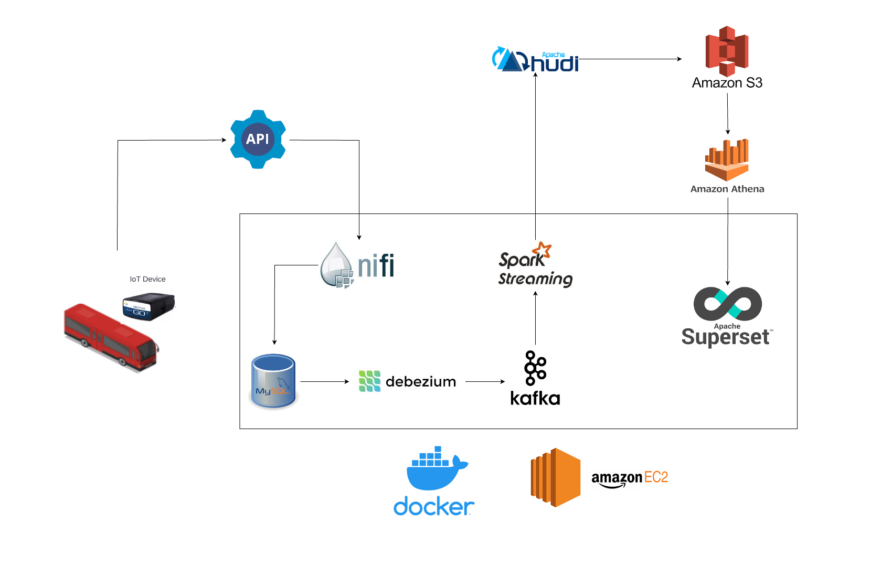

# Real-Time Bus Tracking System Using Apache NiFi, Kafka, and Spark Streaming

This repository contains all the necessary components for setting up a real-time bus tracking application using Apache NiFi, Apache Kafka, Spark Streaming, MySQL, CDC, Apache Superset, and AWS EC2. The primary focus of the project is to build a real-time application that collects GPS data streamed by IoT devices located on buses. The data source used in the project is TTC bus data from an open API called [Rest Bus](http://restbus.info/).

## Getting Started

This project employs a series of technologies to build a data pipeline for real-time analytics. You'll find individual README files for each step of the project, detailing the setup and execution.

## Installation and Setup

Follow the individual README files to set up and install each component of this project:

1. [EC2 and Docker Setup](EC2_Docker_readme.md)
2. [MySQL and Debezium Setup](MySQL_Debezium_readme.md)
3. [Apache NiFi Setup](NiFi_readme.md)
4. [Kafka Setup](kafka_readme.md)
5. [Spark Streaming Setup](sparkstreaming_readme.md)
6. [AWS Athena Setup](athena_readme.md)
7. [Apache Superset Setup](superset_readme.md)

## Usage

Once you've set up all the components, you can run the PySpark streaming script to start ingesting data into your pipeline. The data will flow from Apache NiFi to MySQL, then to Kafka and Spark Streaming, and finally, it will be queried using AWS Athena and visualized in Apache Superset.

